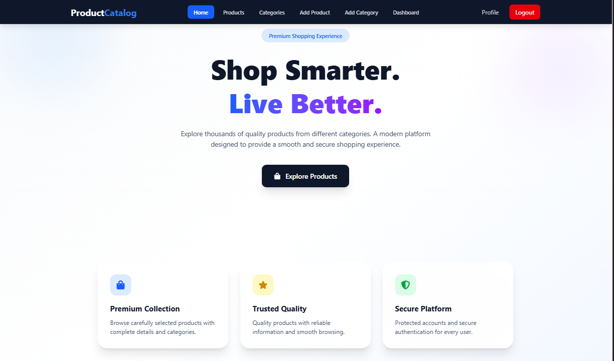
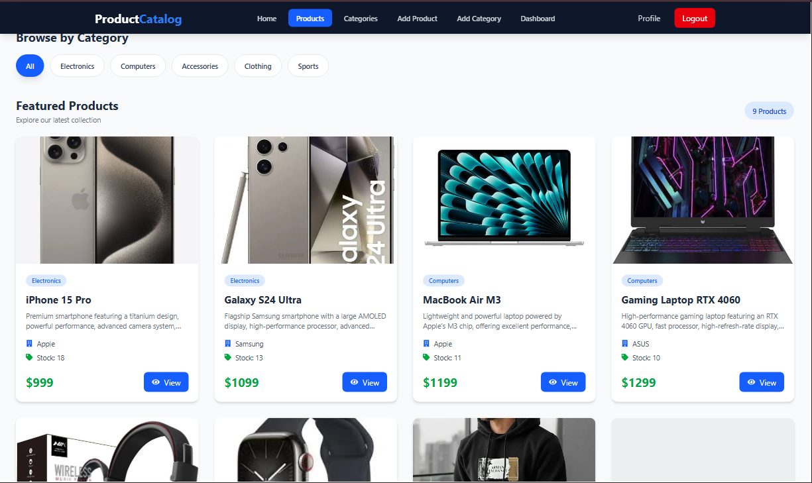
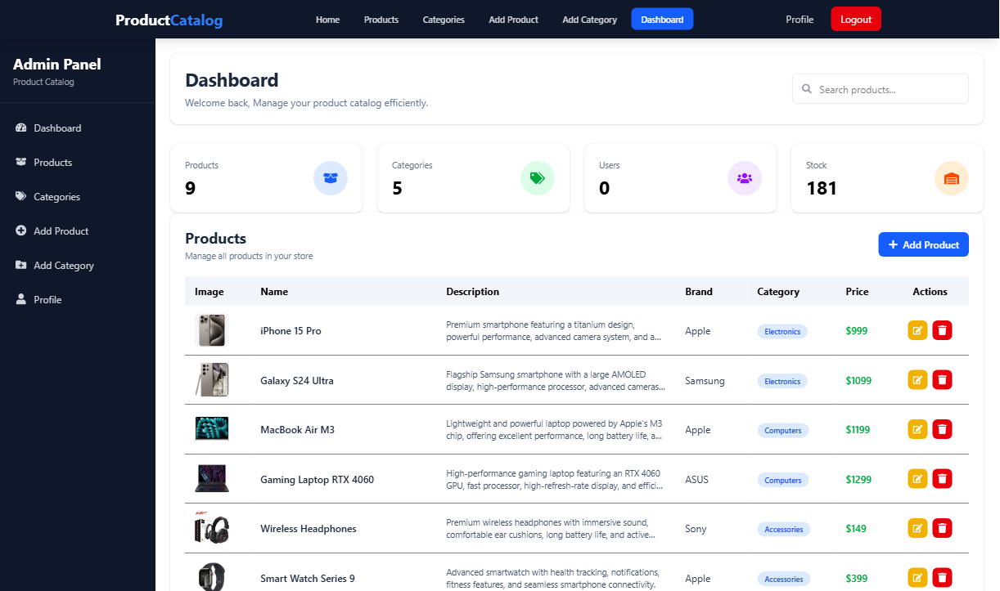

# 🛒 Product Catalog Management System

A full-stack **Product Catalog Management System** built with **React.js, Node.js, Express.js, MongoDB, and Tailwind CSS**.

The application provides a complete product and category management system with secure authentication, role-based authorization, product image uploads, search and filtering, an admin dashboard, and RESTful APIs.

---

## 🚀 Features

### 🔐 Authentication & Authorization

- User Registration
- User Login
- JWT-based authentication
- Protected routes
- Admin-only routes
- Role-based authorization
- Secure password hashing with bcrypt

### 📦 Product Management

- Add products
- View all products
- View product details
- Update products
- Delete products
- Product categories
- Product brands
- Product pricing
- Stock management
- Product image upload
- Product image preview
- Product image serving from backend

### 🗂️ Category Management

- Add categories
- View categories
- Category descriptions
- Update categories
- Delete categories
- Category-based product filtering
- Product count per category

### 🔎 Search & Filtering

- Search products by name
- Filter products by category
- Dynamic product count
- Real-time frontend filtering

### 📊 Admin Dashboard

- Dashboard overview
- Product management table
- Product statistics
- Product search
- Add product functionality
- Edit product functionality
- Delete product functionality
- Product image preview

### 🖼️ Image Management

- Product image upload using Multer
- Images stored in the backend `uploads/products/` directory
- Static image serving through Express
- Frontend image rendering
- Image fallback when an image is unavailable

---

## 🛠️ Technologies Used

### Frontend

- React.js
- React Router DOM
- Tailwind CSS
- Axios
- React Icons
- Vite

### Backend

- Node.js
- Express.js
- MongoDB
- Mongoose
- JWT
- bcrypt
- Multer
- Express Validator
- CORS
- dotenv

---

## 📁 Project Structure

```text
Product-Catalog-Management/
│
├── frontend/
│   ├── src/
│   │   ├── api/
│   │   │   ├── api.js
│   │   │   └── productApi.js
│   │   │
│   │   ├── Components/
│   │   │   ├── Dashboard/
│   │   │   ├── Products/
│   │   │   ├── UI/
│   │   │   └── AppLayout/
│   │   │
│   │   ├── Pages/
│   │   │   ├── Home.jsx
│   │   │   ├── Login.jsx
│   │   │   ├── Register.jsx
│   │   │   ├── Products.jsx
│   │   │   ├── AddProduct.jsx
│   │   │   ├── Categories.jsx
│   │   │   ├── AddCategory.jsx
│   │   │   └── Dashboard.jsx
│   │   │
│   │   ├── App.jsx
│   │   └── main.jsx
│   │
│   └── package.json
│
├── backend/
│   ├── config/
│   │   └── db.js
│   │
│   ├── middleware/
│   │   ├── auth.js
│   │   └── admin.js
│   │
│   ├── models/
│   │   ├── User.js
│   │   ├── Product.js
│   │   └── Category.js
│   │
│   ├── router/
│   │   └── api/
│   │       ├── login.router.js
│   │       ├── register.router.js
│   │       ├── category.router.js
│   │       ├── product.router.js
│   │       └── dashboard.router.js
│   │
│   ├── uploads/
│   │   └── products/
│   │
│   ├── utils/
│   │   └── upload.js
│   │
│   ├── server.js
│   ├── .env
│   └── package.json
│
└── README.md
```

---

## 🔄 Application Workflow

```text
User
  │
  ▼
React Frontend
  │
  │ Axios
  ▼
Express REST API
  │
  ├── JWT Authentication
  ├── Role Authorization
  ├── Input Validation
  ├── Multer Image Upload
  │
  ▼
MongoDB
  │
  ├── Users
  ├── Categories
  └── Products
```

---

## 🔑 Authentication Flow

1. User registers an account.
2. Password is encrypted using bcrypt.
3. User logs in with email and password.
4. Backend verifies the credentials.
5. JWT token is generated.
6. Token is stored on the frontend.
7. Axios interceptor sends the token with protected requests.
8. Backend authentication middleware verifies the token.
9. Admin middleware checks whether the authenticated user has admin privileges.

---

## 🖼️ Product Image Upload

Product images are uploaded using **Multer**.

Images are stored inside:

```text
uploads/products/
```

The Express server exposes the directory as static content:

```javascript
app.use("/uploads", express.static("uploads"));
```

A product image is stored in MongoDB as a path similar to:

```text
/uploads/products/1786084405606-iphone-15-pro.jpg
```

The frontend converts this path into the backend image URL:

```text
http://localhost:5000/uploads/products/1786084405606-iphone-15-pro.jpg
```

---

## 🌐 API Endpoints

### Authentication

| Method | Endpoint | Description |
|---|---|---|
| POST | `/api/register` | Register a new user |
| POST | `/api/login` | Login user |

### Categories

| Method | Endpoint | Access |
|---|---|---|
| GET | `/api/category` | Public/Authenticated |
| POST | `/api/category` | Admin |
| GET | `/api/category/:id` | Authenticated |
| PUT | `/api/category/:id` | Admin |
| DELETE | `/api/category/:id` | Admin |

### Products

| Method | Endpoint | Access |
|---|---|---|
| GET | `/api/products` | Authenticated |
| GET | `/api/products/:id` | Authenticated |
| POST | `/api/products` | Admin |
| PUT | `/api/products/:id` | Admin |
| DELETE | `/api/products/:id` | Admin |

### Dashboard

| Method | Endpoint | Access |
|---|---|---|
| GET | `/api/dashboard` | Admin |

---

## ⚙️ Installation

### 1. Clone the Repository

```bash
git clone https://github.com/binishfaq/Syntecxhub_Product_Catalog_Management
```

```bash
cd Syntecxhub_Product_Catalog_Management
```

---

## 🔧 Backend Setup

Go to the backend directory:

```bash
cd backend
```

Install dependencies:

```bash
npm install
```

Create a `.env` file:

```env
PORT=5000
MONGODB_URI=your_mongodb_connection_string
JWT_SECRET=your_jwt_secret
```

Start the backend server:

```bash
npm run dev
```

Or:

```bash
npm start
```

Backend will run on:

```text
http://localhost:5000
```

---

## 💻 Frontend Setup

Open another terminal:

```bash
cd frontend
```

Install dependencies:

```bash
npm install
```

Start the development server:

```bash
npm run dev
```

The frontend will normally run on:

```text
http://localhost:5173
```

---

## 🗄️ Database

The application uses **MongoDB** with Mongoose.

Main collections:

```text
users
categories
products
```

### Product Relationship

Products reference categories using MongoDB ObjectIds.

```text
Product
   │
   └── category ──────► Category
```

The API uses Mongoose `.populate()` to retrieve category information with products.

---

## 🔒 Security

The application implements several security practices:

- JWT authentication
- Password hashing with bcrypt
- Protected API routes
- Admin authorization
- Input validation
- Environment variables for sensitive configuration
- Authentication middleware
- CORS configuration
- Restricted product/category management

---

## 🔍 Product Search

Products can be searched from the frontend using the product name.

Example:

```text
Search: MacBook
```

The frontend filters products dynamically and updates the displayed results.

---

## 🗂️ Category Filtering

Users can filter products according to their category.

Example:

```text
All
Electronics
Computers
Accessories
Clothing
Sports
```

---

## 📸 Screenshots








---

## 🧪 Testing API with Postman

The backend APIs can be tested using **Postman**.

Example product request:

```http
POST http://localhost:5000/api/products
```

For product creation with an image, use:

```text
Body → form-data
```

Fields:

```text
name          Text
description   Text
brand         Text
price         Text
stock         Text
category      Text
image         File
```

The authenticated admin token must also be included.

---

## 🚧 Challenges Faced

During development, several practical issues were encountered:

### 1. JWT Authentication

Handling authentication between the React frontend and Express backend required configuring Axios interceptors and protected routes.

### 2. Role-Based Authorization

Admin-only operations such as adding, updating, and deleting products/categories required separate authorization middleware.

### 3. Product Image Upload

Integrating Multer and serving uploaded images through Express required correct handling of:

- File storage
- File paths
- Static directories
- Frontend image URLs

### 4. Frontend/Backend Image URLs

One of the major issues was displaying backend images on the frontend because the database stores a relative path while the browser needs the complete backend URL.

### 5. Category Relationships

Products store the category ID rather than the category name, so Mongoose population was used to retrieve category information.

### 6. API Validation

Invalid or missing product/category data was handled using Express Validator and proper HTTP status codes.

### 7. Frontend State Management

Search, filtering, loading states, product lists, and API responses were handled using React state and effects.

---

## 🔮 Future Improvements

The project can be extended with:

- 🛒 Shopping cart
- ❤️ Wishlist
- ⭐ Product reviews and ratings
- 💳 Online payment integration
- 📦 Order management
- 👤 User profile management
- 🔔 Notifications
- 📊 Advanced analytics dashboard
- 📈 Sales statistics
- 🔍 Advanced search
- 💰 Price-range filtering
- ↕️ Product sorting
- 📱 Fully responsive mobile improvements
- ☁️ Cloud image storage using Cloudinary/AWS S3
- 📚 Swagger API documentation
- 🧪 Unit and integration testing
- 🐳 Docker containerization
- ⚙️ CI/CD pipeline
- ☁️ Cloud deployment

---

## 📌 Learning Outcomes

Through this project, I gained practical experience with:

- React component architecture
- React Router
- REST API development
- Express.js
- MongoDB and Mongoose
- JWT authentication
- Role-based authorization
- Password hashing
- API validation
- Axios
- Multer file uploads
- Backend/frontend integration
- CRUD operations
- Search and filtering
- Admin dashboard development
- Error handling


---

## 👨‍💻 Developer

**Zain Bin Ishfaq**


### Skills Used

```text
React.js
Node.js
Express.js
MongoDB
Mongoose
JavaScript
Tailwind CSS
REST API
JWT
Multer
Git & GitHub
```

---

## ⭐ Project Status

```text
Development Status: Completed
```

The current version includes authentication, product management, category management, admin dashboard, search/filtering, and product image upload functionality.

---

## 📄 License

This project was developed for educational and portfolio purposes.